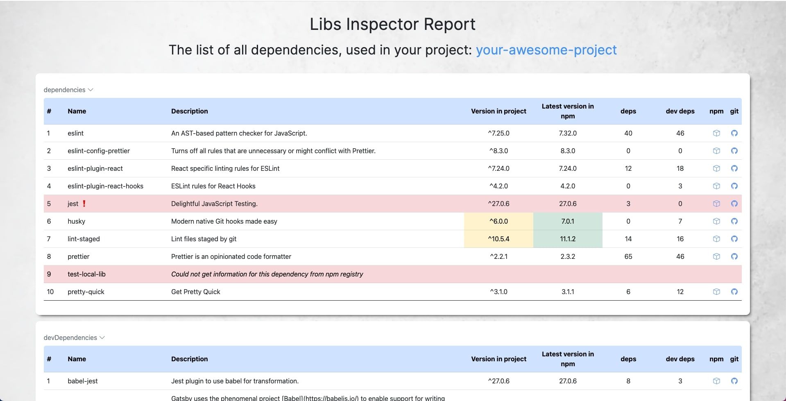

# libs-inspector

[](https://github.com/GoncharIgor/libs-inspector/stargazers)
[](https://github.com/GoncharIgor/libs-inspector)


## What is it

This is a UI representation of all dependencies in your package.json with their description

## Demo

Here is the running [demo](https://goncharigor.github.io/libs-inspector/) of generated libs-inspector report:
[](https://goncharigor.github.io/libs-inspector/)

## Install

```bash
npm install --save-dev libs-inspector
```

## Usage

1. open your `package.json` file
2. add new script with calling `libs-inspector` library
e.g:
```javascript
"scripts": {
   "generate:lib-report": "libs-inspector"
}
```
3. run npm script:  
   `npm run generate:lib-report`
4. in project source root new folder will be generated: `libs-inspector-report`
5. open it's `index.html`

## Details of realisation
- The report generates 2 tables: dependencies and devDependencies
- If your project doesn't have devDependencies, then it will be written in empty block
- Information for each dependency is being retrieved from: https://npms.io
- If the dependency info couldn't be got from `npms.io`, then the row is highlighted in red


## Next features to come
- Highlight the packages, whose major versions should be updated
- collapsible tables for better UX


## License

>You can check out the full license [here](https://github.com/GoncharIgor/libs-inspector/blob/master/LICENSE)

This project is licensed under the terms of the **MIT** license.
